# 08-ansible-01-base

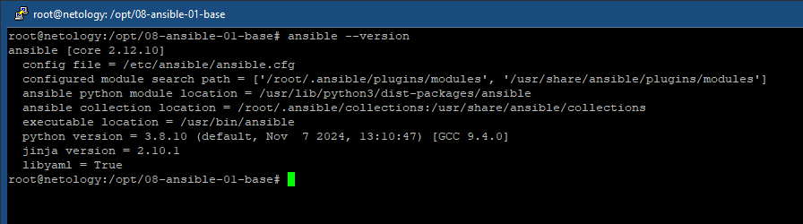
## Основная часть

### 1.

 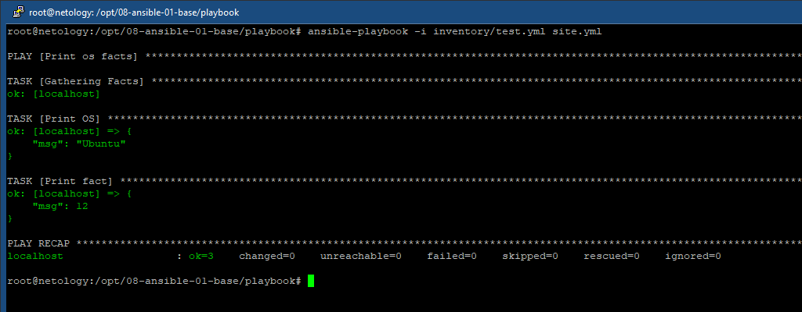
### 2.

 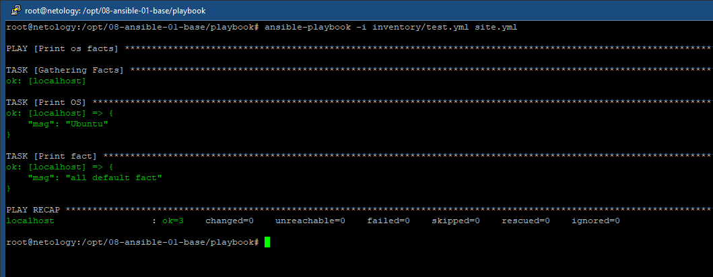
### 3.

Подготавливаем образы контейнеры:

``` bash
docker pull rcarmo/ubuntu-python:3.8-onbuild-amd64
docker pull centos/python-36-centos7:latest
```

Запускаем контейнеры для ./inventory/prod.yml:

``` bash
docker run -d --rm --name ubuntu -it rcarmo/ubuntu-python:3.8-onbuild-amd64 /bin/bash
docker run -d --rm --name centos7 -it centos/python-36-centos7:latest /bin/bash
```

Проверяем:

``` bash
docker ps
```

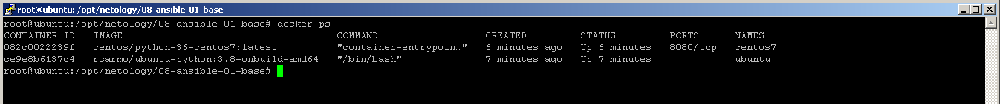
### 4.

``` bash
ansible-playbook -i inventory/prod.yml site.yml
```
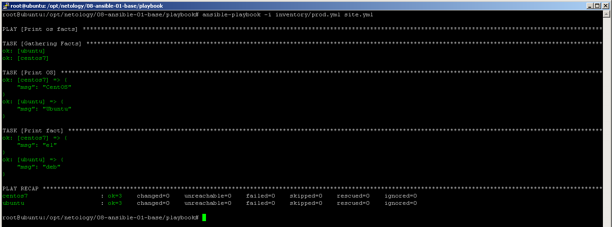
### 5,6.

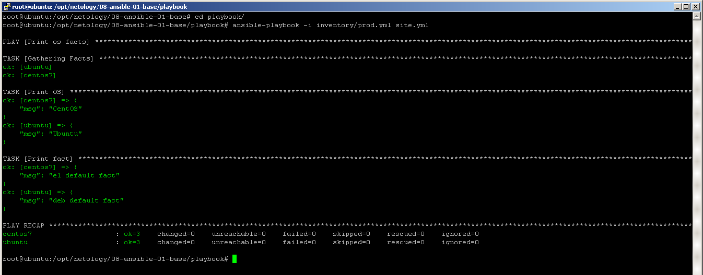
### 7.

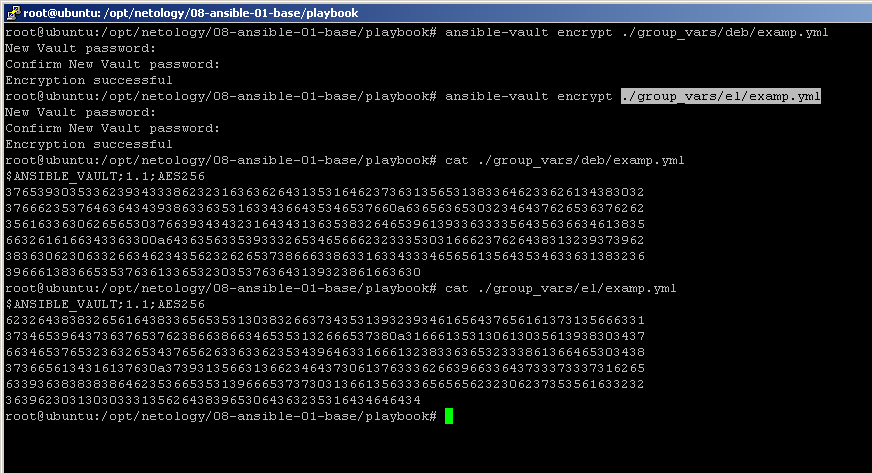
### 8.

``` bash
ansible-playbook -i inventory/prod.yml site.yml --ask-vault-pass
```
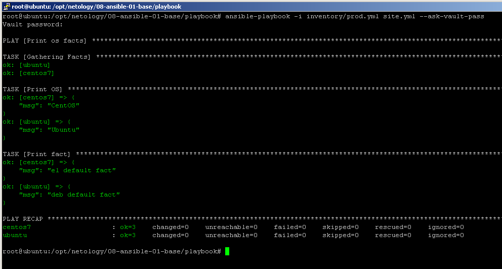
### 9.

``` bash
ansible-doc --type connection --list
```
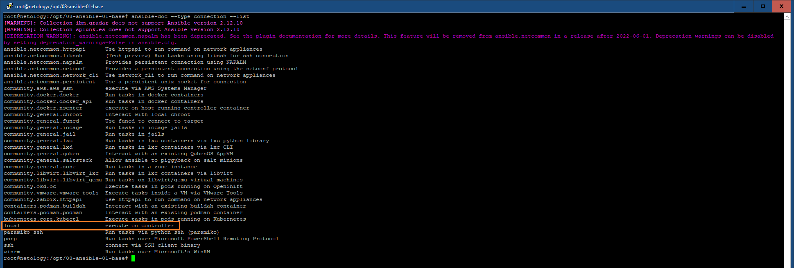
Для работы на control node подходит local
### 10.

prod.yml:
``` yml
---
  el:
    hosts:
      centos7:
        ansible_connection: docker
  deb:
    hosts:
      ubuntu:
        ansible_connection: docker
  local:
    hosts:
      localhost:
        ansible_connection: local
```

### 11.

``` bash
ansible-playbook -i inventory/prod.yml site.yml --ask-vault-pass
```
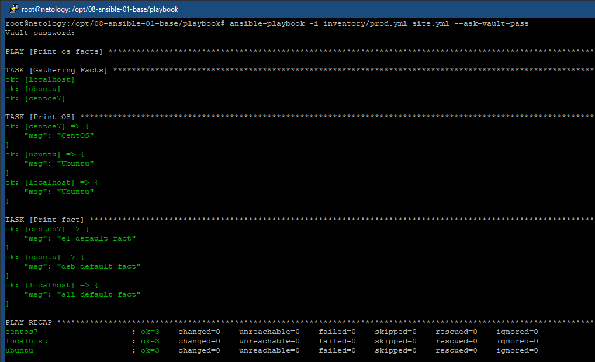

## Необязательная часть
### 1.

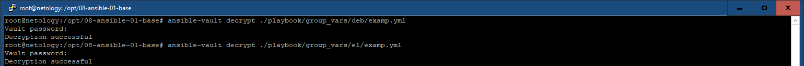
### 2.

``` bash
ansible-vault encrypt_string
```
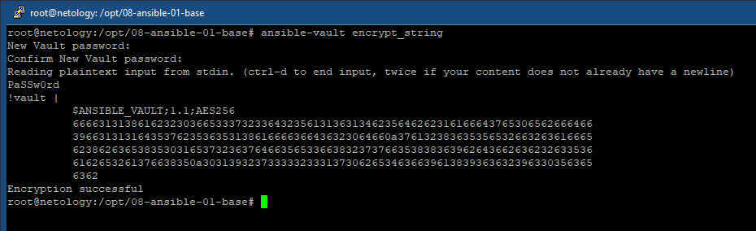
### 3.

``` bash
ansible-playbook -i inventory/prod.yml site.yml --ask-vault-pass
```
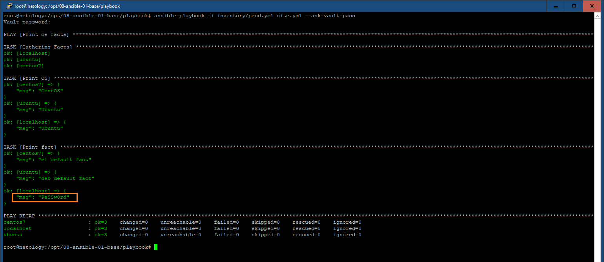
### 4.

Подготавливаем образ контейнера:

``` bash
docker pull pycontribs/fedora
```

Запускаем контейнер:

``` bash
docker run -d --rm --name fedora -it pycontribs/fedora:latest /bin/bash
```

Смотрим переменные:

``` bash
ansible-playbook -i inventory/prod.yml site.yml --ask-vault-pass
```
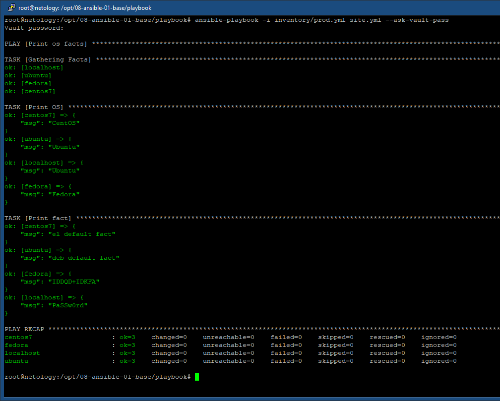


